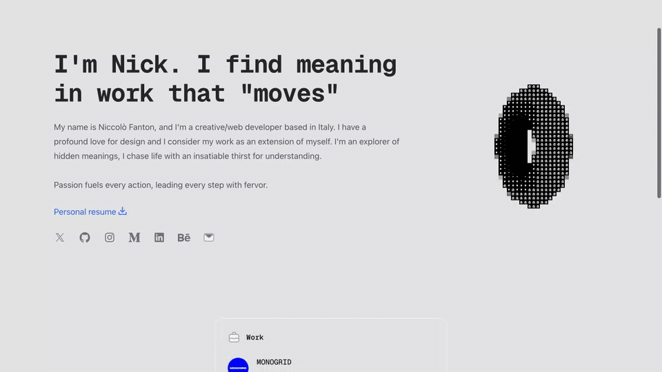

<div align="center">

# niccolofanton.dev



Personal portfolio site with an interactive 3D hero, built on Next.js and React Three Fiber.

[](https://niccolofanton.dev/)
[](https://github.com/niccolofanton/personal-site/stargazers)
[](./LICENSE.md)

**[Visit the live site →](https://niccolofanton.dev/)**

</div>

---

## About

This is the source code for [niccolofanton.dev](https://niccolofanton.dev/), Niccolò Fanton's personal website. It is a statically generated Next.js site that pairs a classic portfolio layout with an interactive WebGL hero rendered through React Three Fiber and post-processing effects.

The project started from the Tailwind UI "Spotlight" template and was extended with a custom 3D scene, animated text and smooth scrolling.

## Features

- Interactive 3D hero scene built with React Three Fiber, drei and `@react-three/postprocessing` (N8AO ambient occlusion and an ASCII render effect), auto-rotating via `OrbitControls`.
- Articles and projects pages with content authored directly in TSX.
- Page transitions and motion via Framer Motion and GSAP, plus Lenis smooth scrolling.
- Light/dark theming with `next-themes` and the Geist font.
- SEO setup (`next-seo`, structured data, `sitemap.xml` and `robots.txt`).
- Configured for deployment to Cloudflare (`wrangler.toml`).

## Tech stack

- **Framework:** Next.js 14 (Pages Router) + TypeScript
- **Styling:** Tailwind CSS + `@tailwindcss/typography`
- **3D / graphics:** three.js, React Three Fiber, drei, postprocessing
- **Animation:** Framer Motion, GSAP, Lenis

> MDX tooling (`@next/mdx`, `@mdx-js/react`) is wired up in the build config, but no MDX content ships in the repo yet — the articles loader currently returns an empty list.

## Getting started

Requires Node.js and [Yarn](https://yarnpkg.com/) (the repo ships a `yarn.lock`).

```bash
# install dependencies
yarn install

# copy environment variables and adjust as needed
cp .env.example .env.local

# start the dev server at http://localhost:3000
yarn dev
```

Build and serve a production bundle:

```bash
yarn build
yarn start
```

Lint the project:

```bash
yarn lint
```

## Credits

- Base layout adapted from the [Tailwind UI](https://tailwindui.com/) **Spotlight** template.
- 3D rendering powered by [React Three Fiber](https://docs.pmnd.rs/react-three-fiber) and the [pmndrs](https://github.com/pmndrs) ecosystem.
- `public/4.jpg` (cover for the datamosh article) carries embedded XMP metadata naming **Manoela Ilic** as its creator. It is the article artwork produced by [Codrops](https://tympanus.net/codrops/), reused here with the article listing.
- `public/2.jpg` carries embedded IPTC/XMP metadata reading *"Copyright by Wilczyński Krzysztof / Muzeum Narodowe w Warszawie"*. The photograph is by **Krzysztof Wilczyński** for the [National Museum in Warsaw](https://www.mnw.art.pl/). Its licence terms have not been verified — see the note below.
- The remaining article covers (`public/1.webp`, `public/3.jpg`, `public/singularity.png`) carry no authorship metadata and have not been traced.
- Company and project marks under `src/images/logos/` belong to their respective owners and are used here only to identify the organisations and projects they refer to.

> **Note on `public/2.jpg`:** the file is explicitly copyright-marked to a third party and is redistributed in this public repository. Its licensing has not been confirmed, and the repository's own licence does not extend to it. It should be re-licensed, replaced or removed.

## License

This project is based on a Tailwind UI template and is distributed under the [Tailwind UI License](./LICENSE.md). Review those terms before reusing the code or design assets.
</content>
</invoke>
